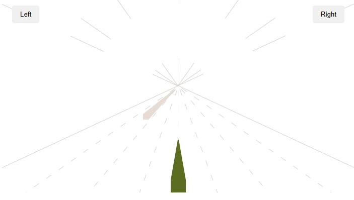

<br />
<div align="center">
  <a href="#">
    
  </a>

  <p align="center">
    Made using HTML and CSS!
    <br />
    <br />
    <a target="_blank" href="">View Demo</a>

  </p>
</div>

## About The Project



<hr>

I tried to recreate this animation on dribbble: <a target="_blank" href="https://dribbble.com/shots/21701623-Website-hero-main-landing-page-design">View</a>


### Installation

Follow the instructions to clone this project

2. Clone the repo
   ```sh
   git clone https://github.com/erickctra/frog-jack.git
   ```
3. Install NPM packages
   ```sh
   npm install
   ```
4. Run
   ```js
   npm run dev
   ```

<p align="right">(<a href="#top">back to top</a>)</p>
